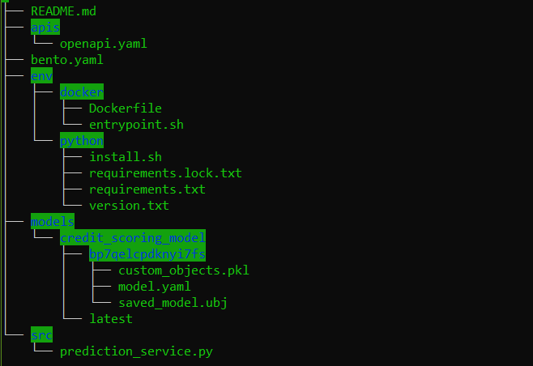

## 7 Machine Learning Production with BentoML

### 7.1 BentoML Introduction

Recalling from what we did in week 5, we convert our prediction with pickle for rapid deployment with flask app that can be used to expose our prediction in the API endpoint which is serverd for service predictions. However, we also see a few limitations when this method is applied to respond to traffic calls arriving in hundreds or even thousands in production environment.  

BentoML propose functionality that allows data scientists and ML engineers to:

   - Make transition from experiment in notebook to ML service with scalability in standard way. You can create and package your ML service useful for production.
   - Customize ML service to fit well with specific use cases.
   - Verify that ML service is ready for production. This includes deployment, monitoring, and operation.

More information can be found here: https://docs.bentoml.org/en/latest/index.html

### 7.2 Building Prediction Service with BentoML

What Bo covered are:

   - Create a bentoML package from jupyter notebook by running bentoML saving procedure.
   - A unique tag is paired with bentoML package each time it is generated. 
   - Writing prediction service that utilizes a model owned by bentoML package. A executable computational unit named "runner" is to scale the model separately from the rest of the service.
   - Passing model running to the service block that define the model serving logic.
   - Placing a service decorator for input inference to respond to the request using the API endpoint.
   - Serving a ML service with `bentoml serve` and load it with address `http://localhost:3000` (in swagger UI) to testing the service. 

### 7.3 Deploying Prediction Service

What Bo covered are:

   - Observing what framework and modules and their version included inside bentoML packages with command `bentoml models get <service+tag>`.
   - Building a deployable bento as described in `bentofile.yaml` with command `bentoml build`.
   - Viewing the bento in tree file structures.

   - Building a docker image containing the bento that can be deployed to various kinds of environments with command `bentoml containerize <service+tag>`.
   - Starting the image with specified port with command `docker run -it --rm -p 3000:3000 <service+tag>` and test the service. 

### 7.4 Sending, Receiving, and Validation Data
