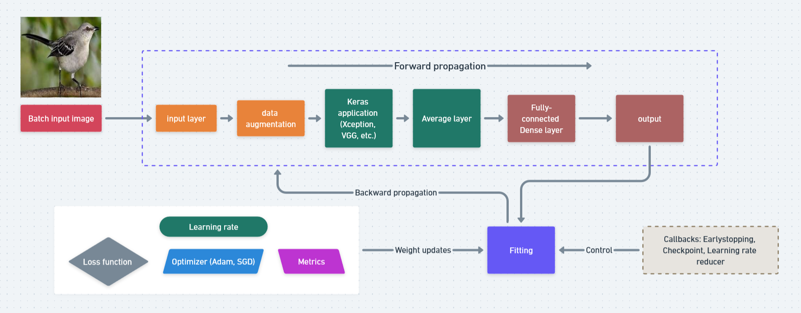

### Deep Learning

This module covers neural network modelling using two most prominent machine learning frameworks: Keras and TensorFlow.

#### Modelling

A few ways to build a neural network:

1) [Sequential](https://www.tensorflow.org/guide/keras/sequential_model)

2) [Functional](https://www.tensorflow.org/guide/keras/functional)

3) Using Pretrained Models to retrain model to answer specific use cases: using base convolutional networks to extract image features. It paired with another output dense layer that match with output structures. 

#### Pretrained Models

List of pretrained Keras applications is provided [here](https://keras.io/api/applications/)

#### Learning Rate

To gain control of weight updates during training, learning rate is applied to optimizer parameters. 

#### Callbacks
