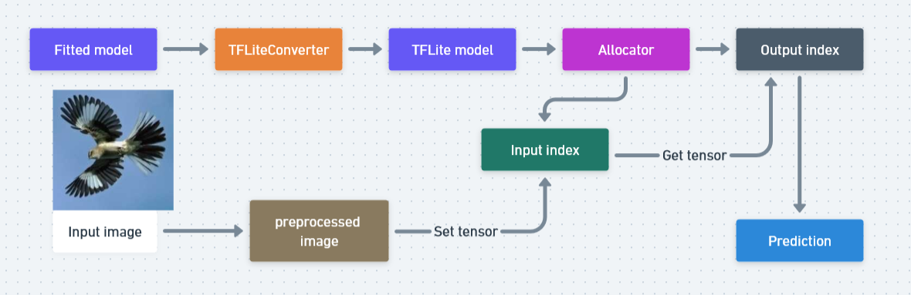
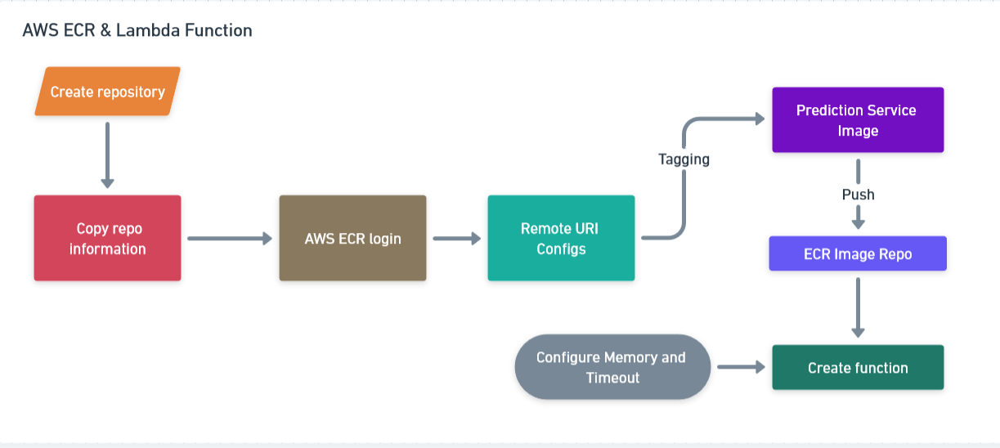

### Serverless Deep Learning

This module covers conversion to Lite and deployment to AWS Container Registry.



### TensorFlow Lite

Machine learning models which are originally developed and trained using TensorFlow core libraries and tools can be converted into model at smaller size that retain predictive performance however with better efficiency. TensorFLow Lite is a lightweight implementation of TensorFlow with a purpose of extending inferrence versatility across various type of devices: mobile, microcontrollers and edge devices; this allows developers and practitioners to easily run their models on these devices without having to worry about issues from limitation from storage, computation, and network.

#### Conversion to TFLite model

Producing TFLite model from a trained TF model could not be much easier than before:

```
import tensorflow as tf

converter = tf.lite.TFLiteConverter.from_keras_model(model)

tflite_model = converter.convert()

with open('model.tflite', 'wb') as f_out:
    f_out.write(tflite_model)
```
#### TFLite Usage

```
import tensorflow.lite as tflite

interpreter = tflite.Interpreter(model_path='model.tflite')
interpreter.allocate_tensors()
```

More details can be read [here](https://www.tensorflow.org/lite/models/convert/convert_models)

#### Amazon ECR and Lambda Function


