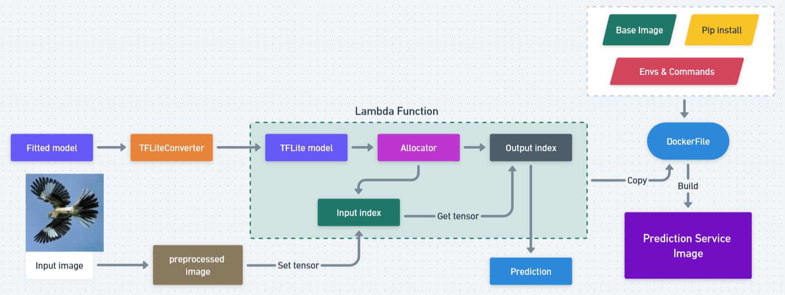

### Serverless Deep Learning

This module covers conversion to Lite and deployment to AWS Container Registry.

#### Conversion to TFLite model

Machine learning models which are originally developed and trained using TensorFlow core libraries and tools can be converted into model at smaller size that retain predictive performance but with better efficiency. More details can be read [here](https://www.tensorflow.org/lite/models/convert/convert_models)

#### Lambda Function

#### Amazon ECR