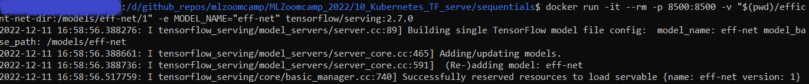

### Kubernetes and TensorFlow Serve

This module covers the practices of ramping up prediction in packages with Kubernetes and TensorFlow Serve.

### Kubernetes

### TensorFlow Serve

For more detail on serving TensorFlow model with docker, please read [here](https://www.tensorflow.org/tfx/serving/docker)

Since my practice took a different approach with what covered in video 10.2, library `keras_image-helper` is not used to preprocess image. 

Also, after many times failing to run docker in bash terminal VSCode, luckily Ubuntu can get this works.

#### Sequential model (using feature extraction from VGG16)

```
docker run -it --rm -p 8500:8500 -v "$(pwd)/seq-model-dir:/models/sequential/1" -e MODEL_NAME="sequential" tensorflow/serving:2.7.0
```

Here is a screenshot of starting tf-serving with Docker in Ubuntu:


Then, you can give it a try predicting an image example by running command cells in jupyter notebook `tf-serving-connect-sequential-model.ipynb`.

#### EfficientNet model

```
docker run -it --rm -p 8500:8500 -v "$(pwd)/efficient-net-dir:/models/eff-net/1" -e MODEL_NAME="eff-net" tensorflow/serving:2.7.0
```



Variable of `host`, `channel`, and `stub` in `tf-serving-connect-sequential-model.ipynb`must be updated so that its prediction service can receive model serving delivered from running docker.

#### Testing Gateway in Flask App

A python script is used to run a flask app acting as "Gateway" for receiving `host` and `channel` from running docker and an input image, and it is executed in the Pipenv environment.

    1) Create a new bash tab and activate Pipenv with `pipenv shell`.
    2) Confirm that a running docker, which hosting efficient net model serving, remains active.
    3) Start flask app with command `python gateway_efficient_net.py`. 
    4) Create a new bash tab and execute `test_efficient-net-serving.py` and wait its prediction to come out.
    5) You can try predicting other images listed in `list_urls_bird.txt` by replacing `url`s value in `test_efficient-net-serving.py` and re-run it.

#### Docker-compose

To make model serving and gateway easier to manage and maintain, we take a step-up on docker by defining iamges using these files: `image-gateway.dockerfile` and `image-model.dockerfile`. 

Building a docker image (note that the directory `efficient-net-dir` is a subdirectory from `sequentials`)

```
docker build -t zoomcamp-eff-net:eff-net-v1  -f image-model.dockerfile
```

Do the same with gateway:

```
docker build -t gateway-eff-net:eff-net-v1  -f image-gateway.dockerfile .
```

As there are two images, we want to see that two different dockers can interact with each other within the same network group. Images built using two dockerfiles as covered above are then put together into a single large package: `docker-compose.yaml`.

Command `docker-compose up` will start up gateway and model serving images simultaneously.
