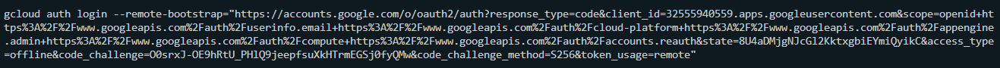
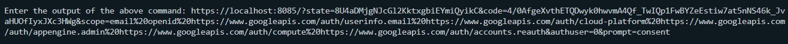
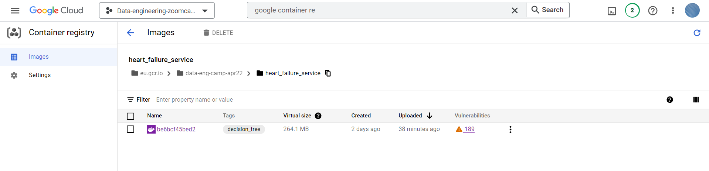
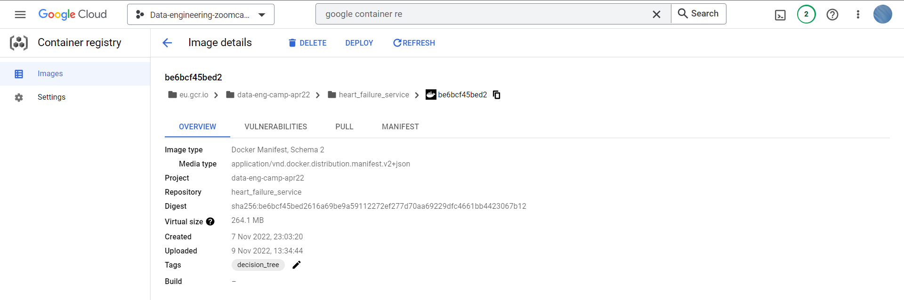
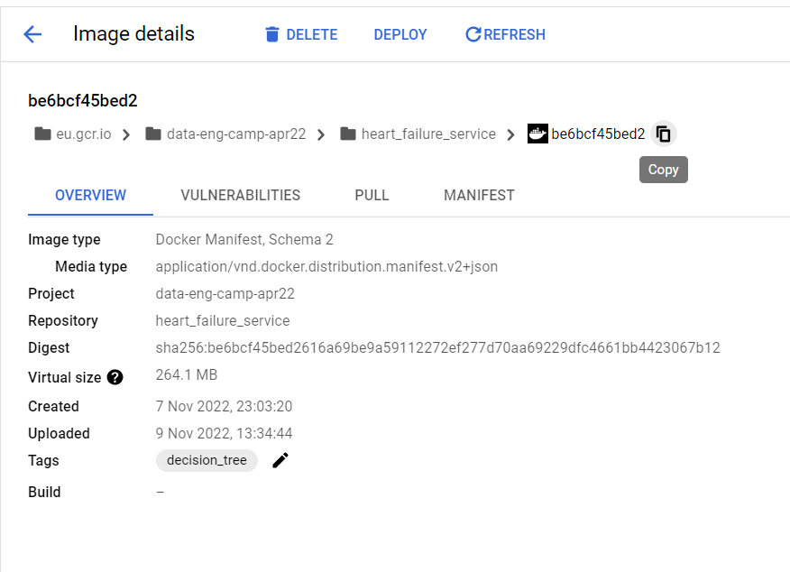
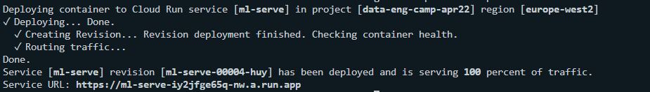
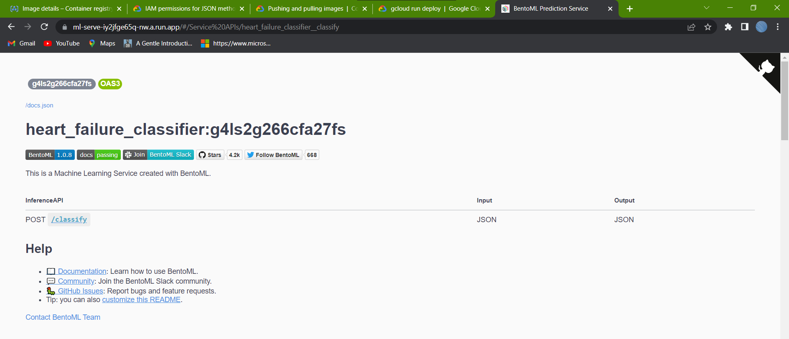
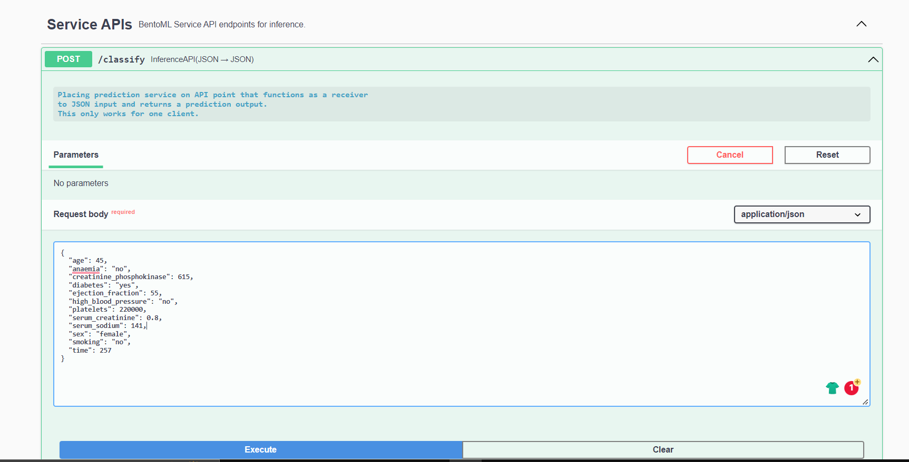

## Capstone Project 

A first project of MLZoomcamp. This repo is served with purpose of demonstration how far we utilise what we have learned until week 7.

### Dataset Description

This project will take a focus on heart failure using a dataset collected from [Kaggle 2020](https://www.kaggle.com/datasets/andrewmvd/heart-failure-clinical-data) and compiled by Ahmad and colleagues (2017). The dataset holds the medical records of 299 patients aged between 40 and 95 years old accounted by 105 females and 194 males. This gathering was carried out at the Faisalabad Institute of Cardiology and at the Allied Hospital in Faisalabad, Pakistan between April and December 2015. 

### Attribute Information

| Feature Name        | Explanation           | Measurement  |  Range  |
| ------------- | ------------- |  ----- |  ----- | 
| Age      | Age of the patient | years |  [40,…, 95]  |
| Anaemia      | Decrease of red blood cells (haemoglobin) |  binary |  0, 1  |
| Creatinine_phosphokinase | CPK level in the blood |   mcg/L | [23, …, 7861] |
|  Diabetes	 | Presence of diabetes |	binary |	0, 1 |
| Ejection_fraction | 	Percentage of blood leaving the heart at each contraction | 	float	| [14, …, 80] | 
| High Blood Pressure | 	Presence of high blood pressure | 	binary	| 0, 1 | 
| Platelets | 	Platelets in the blood | 	Kiloplatelets/mL	| [25.01, …, 850.00] | 
| Serum_creatinine | 	Creatinine level in the blood | 	mg/dl	| [0.50, …, 9.4] | 
| Serum_sodium |	Sodium level in the blood |	mEq/L |	[114, …, 148] |
| Sex |	Male or female | 	binary |	0, 1 |
| Smoking |	Smoking or not smoking |	binary |	0, 1 |
| Time |	Follow-up period |	days |	[4, …, 285] |
| Death_event |	Confirmed death during follow-up period |	binary |	0, 1 |

#### Relevant Paper
Chicco, D. and Jurman, G. (2020) ‘Machine learning can predict survival of patients with heart failure from serum creatinine and ejection fraction alone’, BMC Medical Informatics and Decision Making, 20(1), pp. 1-16. Available at: https://doi.org/10.1186/s12911-020-1023-5.

Ahmad, T. et al. (2017) ‘Survival Analysis of Heart Failure Patients: A Case Study’, PLoS ONE, 12(7). Available at: https://doi.org/10.1371/journal.pone.0181001.

## 1) Description
### Problem Context/Project Description

For this midterm project, a binary classification model is implemented on the case of heart failure with an aim of predicting patients' survival.

Models involved in learning and generalising the context are decision tree, random forest and XGBoost. 

A notebook with a detailed description of the Exploratory Data Analysis (EDA), and model building and tuning is presented in `project.ipynb`. Python scripts that specifically designed for training and storing its artifact are prepared in `train.py`. A flask application served for responding to input data submitted from `send_data.py` is available in file `prediction_service.py`. The model registry is called from that flask for deployment (in waitress/gunicorn).

### Files

- `readme.md`: A full description of the project for reader to gain a greater picture of this project.
- `heart_failure_clinical_records_dataset.csv`: The collection of heart failure records in CSV format.
- `project.ipynb` : A jupyter notebook containing model building and parameter fine-tuning. This file also build ML packages in bentoml.
- `heart_failure_profile.html`: A summary of exploratory data analysis on heart failure in web page. This was produced with `pandas_profiling`.
- `training.py`: A python app that build a bentoml registry.
- `prediction_service_sklearn.py`: A service app in sklearn that call a trained model from BentoML artifact to give a prediction to input data in flask service.
- `prediction_service_xgboost.py`: A service app in xgboost that call a trained model from BentoML artifact to give a prediction to input data in flask service.
- `send_data.py`: A python app that gives a request and delivers an input data to a service app to produce a prediction.
- `Pipfile`: A Pipfile for collection of libraries and modules dependencies.
- `bentoml.yaml`: A structured file to produce/build a ML service container.

## 2) EDA, Feature Correlation, Feature Importance

A few findings to learn: 

**EDA**
- All columns are completely free from missing values and type inconsistencies, thus ruling out requirements for data filling. 
- Columns that holds binary data are in the state of integer types. We convert them to boolean/categorical types with pandas map function.
- Visual graph sees non-gaussian (non-normal) distributions on features `creatinine_phosphokinase`, `platelets`, `serum_creatinine`, and `serum_sodium`. Since we use tree models in building predictive learning, transforming with `np.log1p()` or other functions is not necessary.

**Group Risk Factor by Mean**
- Patients suffering `anaemia` tend to have higher risk than those who do not: the risk of mortality is 1.11 for anameia group against 0.916 for all patient not being treated as to having anaemia.
- Risk is higher for everyone that suffered from `high_blood_pressure`, in which its marginal proportion is 1.15. Meanwhile, people whose free from this ailment have lower risk (0.916).
- Risk differences due to `smoking` and `diabetes` are considerably lower than the group which are not subjected to these conditions.

**Mutual Information**
- Mutual information shows a similar result on feature imporatance: `anaemia` and `high_blood_pressure` are among categorical features that affect the risk of death. 
- Mutual information on categorical features shows an extremely weak relationship on target `DEATH_EVENT` to all categorical features.

**Feature Correlation**  
- A considerably high relationship on `DEATH_EVENT` with features `age`, `ejection_fraction`, `serum_creatinine`, and `time`.
    

## 3) Running the Code 

### Model Building and Fine-Tuning
    1) Prepare a file named `Pipfile` on a directory where projects locates. `Pipfile` gathers collection of modules which are utilized for development and production. 
    2) After gathering modules in `Pipfile`, install pipenv with command `pipenv install`. You can also install other modules if any update of requirements comes by (for example, `pipenv install xgboost` if we decide to include xgboost for adding another predictive modelling). 
    3) Activate pipenv environment with command `pipenv shell` following the completion of pipenv installation. At this point, we are ready to do a few tasks.
    4) Conduct data exploration and preprocessing before proceeding to model fitting with tree-based learning. Then, we build machine learning models followed by parameter tuning for three models that produce the best possible prediction on the test set. These are extensively done in `project.ipynb`. 

### Running Model Training and Results on the Test set

Run file `train.py` with additional arguments listed below:

    - `python train.py "Decision Tree" "sklearn"`
    - `python train.py "Random Forest" "sklearn"`
    - `python train.py "XGBoost" "xgboost"`

You will see a list of models are already stored in BentoML with `bentoml models list`. 

Model prediction results:

| Model       | ROC AUC           |
| ------------- | ------------- |  
| Decision Tree Classifier      | 0.801 |    
| Random Forest Classifier      | 0.867 | 
| XGBoost Tree-based | 0.889 |  

## 4) Testing BentoML

Start a prediction service with command `bentoml serve prediction_service_sklearn:svc` or `bentoml serve prediction_service_xgboost:svc`, then open a new bash tab that lets you send a data with `python send_data.py`. A response will appear a few seconds later. 

### Containerizing bentoml package into Docker Image

Specify lists of libraries and include a prediction service python script in file `bentofile.yaml`. Command `bentoml build` in a directory storing `bentofile.yaml` and `train.py` will allow a bentoml package to be generated.

Generate a docker container with `bentoml dockerize heart_failure_classifier:<tag>`. Then, run the container in local machine with `docker run -it --rm -p 3000:3000 <heart_failure_classifier:<tag>` and send a data by executing `python send_data.py` to see whether the container is successful in responding to its json input request.

#### Performing under multiple requests in parallel

    1) Do the same as mentioned in previous section but with a little change: we will make multiple calls by running `locustfile.py`. Since this project is developed in Windows, so after executing `locust -H http://localhost:3000`, locust UI would appear in `http://localhost:8089`.
    2) Set number of users and spawn rate. Start with 100 and 10, respectively. Observe how the prediction service fare against concurrent requests: it would be great if responses run well without fails.  
    3) Reports are available to read in `Locust_async_reports` directory.

## 5) Deploy to Google Cloud

This time, I use my existing remote host from Google Cloud. What I have to do:

    1) Starting Compute Engine and preparation:
        - Update python in anaconda to 3.9.12
        - Create a new directory `mlzoomcamp` just to work with pipenv environment.
        - Authenticate gcloud with `gcloud auth login`. Just continue to authenticate with your personal account by pressing `Y`. As its first response you may see like this:

Then, copy that long code and swith window from remote host to local machine and paste it on bash terminal. A web browser will automatically start to load the page you need to enter your username and password. If this succeeds, the second response is given as shown below:

Copy that response code and back to the remote host, then paste it. After your credential is accepted, you just only need to choose your project ID (if any) and begin your work.

    2) Configure container registry (https://cloud.google.com/container-registry/docs/advanced-authentication#gcloud-helper):
        - Configure Docker (if Docker has been installed) with `gcloud auth configure-docker`. A credential is saved in your user home directory

    3) Download a docker image from my docker hub. Retrieve an image by running `docker pull 21492rar/heart_failure_machine_learning:g4ls2g266cfa27fs`.

    4) Push a downloaded image to container registry in two steps:
        - `docker tag <IMAGE ID> <HOST NAME>/<PROJECT_ID>/<TARGET_IMAGE>:<TAG>`
        - `docker push <HOST NAME>/<PROJECT_ID>/<TARGET_IMAGE>:<TAG>`

    5) Deployment with Google Cloud Run (https://cloud.google.com/sdk/gcloud/reference/run/deploy):
        - Deploy the image stored in container registry with command `gcloud container images list-tags eu.gcr.io/data-eng-camp-apr22/heart_failure_service`

        - When it is successful, an unique url will appear. Copy the url to the browser of your choice.

        - You are ready to try input the data and test its predictive ability.
        

This structure takes an inspiration from 
https://github.com/ziritrion/ml-zoomcamp/tree/main/07_midterm_project