### Project 1: Image Classification on Bird

This project focuses on restating purposes of pretrained model deep learning that becomes able to tell distinction features of three species of birds: Red-headed woodpecker, Northern mockingbird, and Wood duck.

Two pretrained models previously trained on imagenet are chosen : VGG16 and EfficientNetB2.

### Image Preparation

Three images are available for download from https://images.cv/. As their directories are in state of zip format, we would have to modify its tree structure that TensorFlow could be able to build complex input pipelines.

#### Building Data Pipeline


#### Building Models


#### Training


#### Testing

#### Serverless

    After getting `lambda_function.py` ready for deployment, we use docker to contain the file along with tflite model.

    ```
    docker build -t serverless-bird:eff-net-v1  -f serverless-bird.dockerfile .
    ```

    This image has been available in [docker hub](https://hub.docker.com/r/21492rar/bird-image-classification/tags). So you may pull the image and push it to ECR.

    1. Prepare docker image
        - Create a new repository `bird-tflite` with command `aws ecr create-repository --repository-name bird-tflite`
        - Login to docker with commadn `docker login -u AWS -p $(aws ecr get-login-password --profile default) \
                    https://071714138980.dkr.ecr.eu-west-2.amazonaws.com`
        - Pull the specified image with `docker pull 21492rar/bird-image-classification:serverless-bird`

    2. Push to AWS ECR

        - place value for `REMOTE_URI` with command below:
        ```
        ACCOUNT=071714138980
        REGION=eu-west-2
        REGISTRY=bird-tflite
        PREFIX=${ACCOUNT}.dkr.ecr.${REGION}.amazonaws.com/${REGISTRY}

        TAG=bird-tflite-eff-net-v1
        REMOTE_URI=${PREFIX}:${TAG}
        ```
        - command `docker tag 21492rar/bird-image-classification:serverless-bird ${REMOTE_URI}`
        - command `docker push ${REMOTE_URI}`
        - Ensure the completion of pushing the image to ECR
        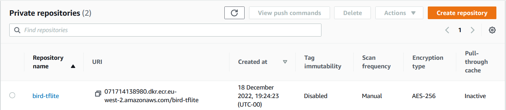
        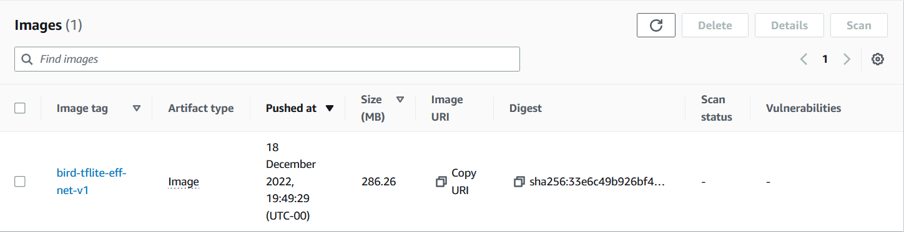

        - Create lambda function
        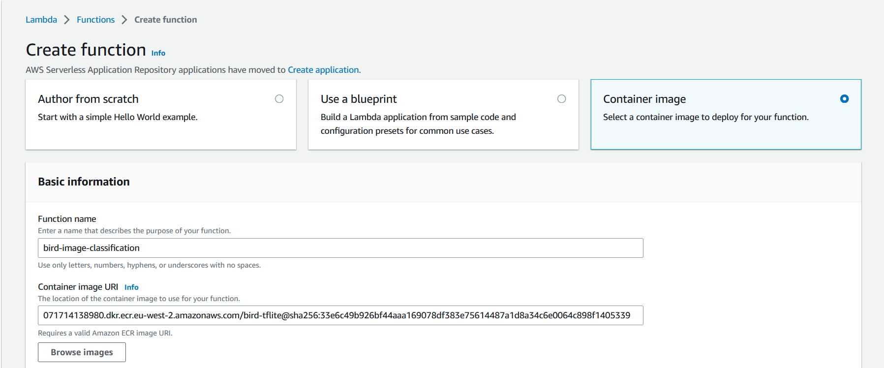

        - Configure memory
        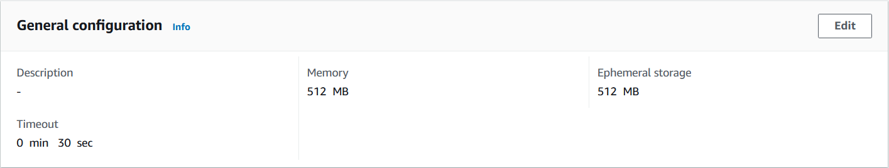

        - Testing
        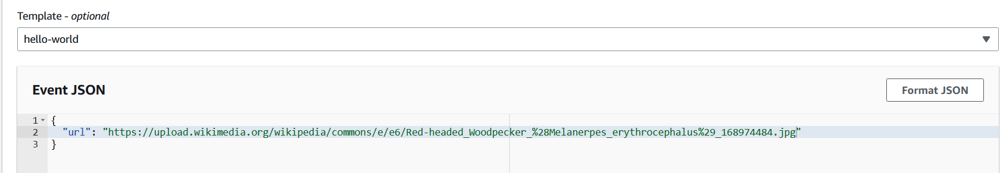
        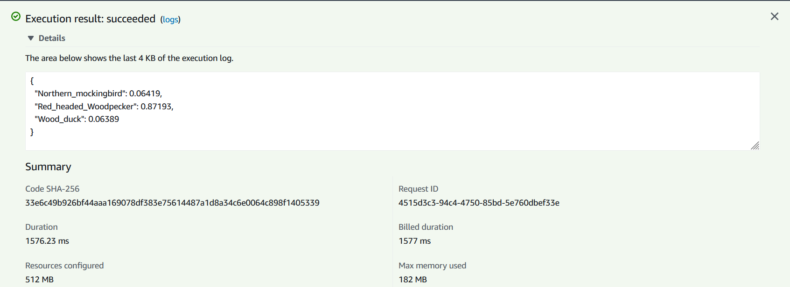
        

    3. Exposing Gateway

        - API Gateway -> Build REST API
        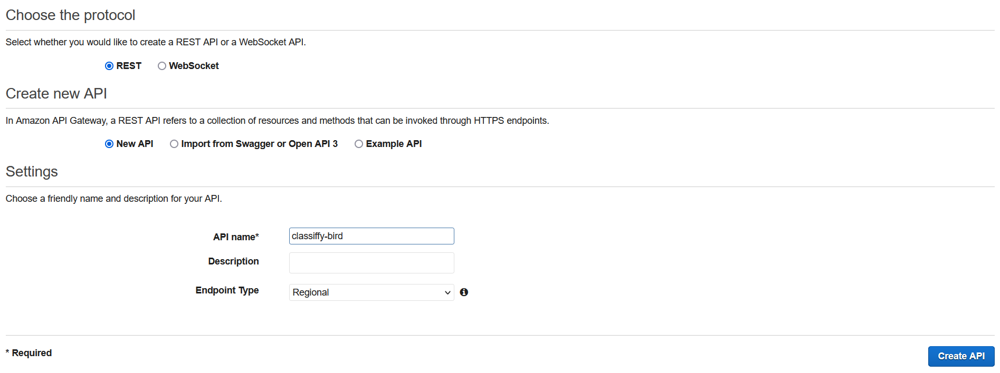
        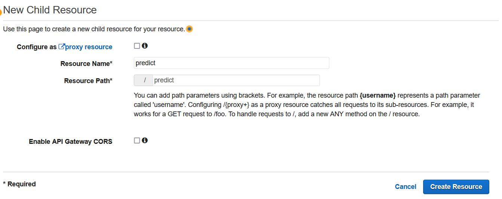
        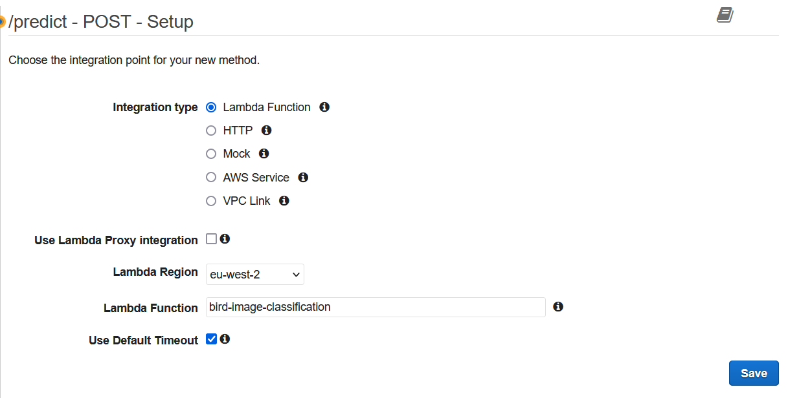

        An entire cycle of gateway API using lambda function is presented below:
        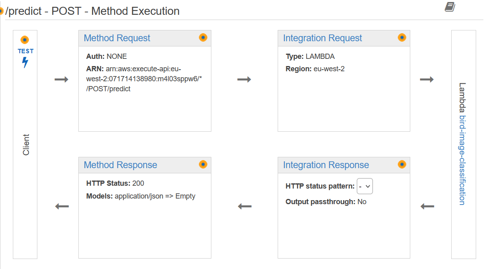

        - Put the same url to `Request Body` and test:
        ```{
            "url": "https://upload.wikimedia.org/wikipedia/commons/c/c8/Wood_Duck_%28Aix_sponsa%29.jpg"
            }```
        The result should look like this: 
        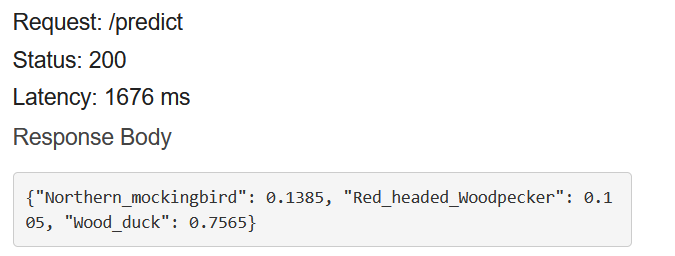

        - Deploy API: copy the generated/invoked URL and paste it to `test_efficient-net-serving.py` as `url`.
        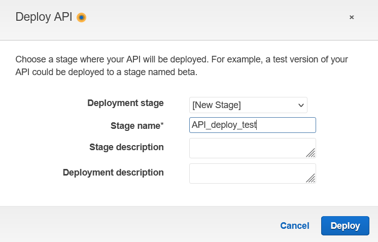

        - Test with python `python test_serverless.py`

#### Conversion to SavedModel

Start with command `ipython`. Interactive python is launched.

Then, write and enter each line:

```
import tensorflow as tf
from tensorflow import keras

model_seq = keras.models.load_model('./model_seq.h5')
tf.saved_model.save(model_seq, 'seq-model-dir')

model_eff_net = keras.models.load_model('./model_efficient_net.h5')
tf.saved_model.save(model_eff_net, 'efficient-net-dir')
```

Tree structure of SavedModel deep learnings should be shown as below:

Retrieve signature definition of `efficient-net-dir `. We will use them later.

```
saved_model cli show --dir efficient-net-dir 
```

Copy and paste information of input-output and saved them in a new txt file.

#### TF-Serving

#### Sequential model (using feature extraction from VGG16)

```
docker run -it --rm -p 8500:8500 -v "$(pwd)/seq-model-dir:/models/sequential/1" -e MODEL_NAME="sequential" tensorflow/serving:2.7.0
```

Here is a screenshot of starting tf-serving with Docker in Ubuntu:

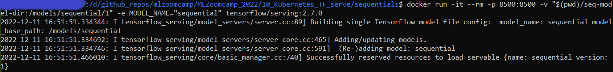

Then, you can give it a try predicting an image example by running command cells in jupyter notebook `tf-serving-connect-sequential-model.ipynb`.

#### EfficientNet model

```
docker run -it --rm -p 8500:8500 -v "$(pwd)/efficient-net-dir:/models/eff-net/1" -e MODEL_NAME="eff-net" tensorflow/serving:2.7.0
```

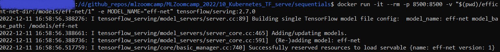

Variable of `host`, `channel`, and `stub` in `tf-serving-connect-sequential-model.ipynb`must be updated so that its prediction service can receive model serving delivered from running docker.

#### Testing Gateway in Flask App

A python script is used to run a flask app acting as "Gateway" for receiving `host` and `channel` from running docker and an input image, and it is executed in the Pipenv environment.

    1) Create a new bash tab and activate Pipenv with `pipenv shell`.
    2) Confirm that a running docker, which hosting efficient net model serving, remains active.
    3) Start flask app with command `python gateway_efficient_net.py`. 
    4) Create a new bash tab and execute `test_efficient-net-serving.py` and wait its prediction to come out.
    5) You can try predicting other images listed in `list_urls_bird.txt` by replacing `url`s value in `test_efficient-net-serving.py` and re-run it.

#### Docker-compose

To make model serving and gateway easier to manage and maintain, we take a step-up on docker by defining iamges using these files: `image-gateway.dockerfile` and `image-model.dockerfile`. 

Building a docker image (note that the directory `efficient-net-dir` is a subdirectory from `sequentials`)

```
docker build -t zoomcamp-eff-net:eff-net-v1  -f image-model.dockerfile .
```

Do the same with gateway:

```
docker build -t gateway-eff-net:eff-net-v1  -f image-gateway.dockerfile .
```

As there are two images, we want to see that two different dockers can interact with each other within the same network group. Images built using two dockerfiles as covered above are then put together into a single large package: `docker-compose.yaml`.

Command `docker-compose up` will start up gateway and model serving images simultaneously.


### Kubernetes

#### Local Deployment


#### EKS


### Gradio

Alternatively, you can also the interactive way to 

1) Download from docker hub and run image

    - `docker pull 21492rar/bird-image-classification:serverless-bird`
    - `docker pull 21492rar/bird-image-classification:gradio-effnet`

2) HuggingFace
This portal offers compaibility with gradio. As I choose for free hosting, just expect a slow inference when playing around with this app