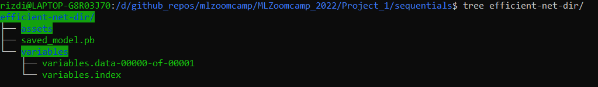

## Project 1: Image Classification on Bird

A second project of MLZoomcamp. This repo is served with purpose of presenting what and how transfer learning can understand bird species with machine learning engineering practices.

## 1) Introduction
### Problem Context

I came across the idea of making better use of pretrained Keras models that would see itself being able to learn and recognize variational patterns of animals under the same class, particularly class of bird. Acknowledging my liking of bird, I took a decision to put my machine learning engineering ability and knowledge into building project that would share meaningful purpose that machine learning could hope to achieve.

This project focuses on restating purposes of pretrained model deep learning (transfer learning) that becomes able to tell distinction features of three species of birds: Red-headed woodpecker, Northern mockingbird, and Wood duck.

EfficientNetB2 is chosen as a convolutional base and a customised fully-connected layer is placed on the top of this base. This layer is tasked to give output based on probability generated from a `softmax` output layer. Confusion matrix is used for measuring quality.

### Dataset Image 

Three images are available for download from https://images.cv/. As their directories arrived in zip format, it would be neceassary to run through steps of modification and file organization so that TensorFlow could be able to submit images to training model across input pipelines in batches.

### Project Description

Sequences of executions begins from image preparation and analysis, deep learning building, training, and measuring accuracy; these are covered in `bird_classification.ipynb`. Trained models, resides in directory 'sequentials', goes through conversion process in which its structures change from `assets`, `variables`, and `savedmodel.pb` to TFlite format and SavedModel suitable for sending prediction in respond to incoming requests across REST API or running docker images.

Model deployment is carried out under two scenarios: serverless and gateway. Python scripts that specifically designed for responding to requests and serving prediction are prepared in `lambda_function.py` and `gateway_efficient_net.py`. A prediction service composed of runners and APIs is served for responding to input data submitted from `test_serverless.py` and `test_efficient-net-serving.py`. Docker is used as a main backbone of building and deploying images to AWS cloud service.


### Files

- `readme.md`: A full description of the project for reader to gain a greater picture of this project.
- `images_<bird_species>`: The collection of bird images in jpeg format. Breakdowns of each of their image directories are `train`, `val`, and `test`.
- `bird_classification.ipynb` : A jupyter notebook that covers steps from image preparation and analysis to prediction against `test` images. Also included in this file: converting ML to `.tflite` with TFLite along with inference testing.
- `lambda_function.py`: A python app that serves predictive function to respond to requests across AWS Lambda.
- `test_serverless.py`: A python file for testing response of `lambda_function.py`.
- `serverless-bird.dockerfile`: A dockerfile for building docker image containing functions defined from `lambda_function.py`.
- `tf-serving-connect-sequential-model.ipynb`: A jupyter notebook that covers testing on models specifically tailored for TensorFlow serving.
- `gateway_efficient_net.py`: A flask app that makes use of trained EfficientNet in container to make inference of incoming image URL input.
- `test_efficient-net-serving.py`: A python file for testing response of `gateway_efficient_net.py`.
- `image-model.dockerfile`: A dockerfile for building docker image containing trained EfficientNet stored in `efficient-net-dir` and run it with TensorFlow Serving.
- `image-gateway.dockerfile`: A dockerfile for building docker image containing application built from `gateway_efficient_net.py`.
- `docker-compose.yaml`: A docker compose that coordinate and run two images `gateway` and `model` simultaneously. 
- `Pipfile`: A Pipfile for collection of libraries and modules dependencies.
- `list_urls_bird.txt`: A text file serves as a storage of collections of URLs directed to birds.
- `model_seq.h5`: A h5 file that host weights of trained sequential model.
- `model_efficient_net.h5`: A h5 file that host weights of trained EfficientNet model.


### Important Note about environment

This project used three different environments, with most of parts were done in conda environment: 

- a conda environment using python 3.8.12 for working on `bird_classification.ipynb` in local machine, noticing the compatibility issue of module `Keras` with `Pipfile`. 
- a conda environment using python 3.9.15 for experimenting image deployment kubernetes in AWS remote.
- a pipenv using python 3.9.13 solely for containerization of `gateway_efficient_net.py`.


## 2) Conversion to SavedModel

Start with command `ipython`. Write and enter each line:

```
import tensorflow as tf
from tensorflow import keras

model_seq = keras.models.load_model('./model_seq.h5')
tf.saved_model.save(model_seq, 'seq-model-dir')

model_eff_net = keras.models.load_model('./model_efficient_net.h5')
tf.saved_model.save(model_eff_net, 'efficient-net-dir')
```

Tree structure of SavedModel deep learnings should be shown as below:



Retrieve signature definition of `efficient-net-dir ` (located in `sequentials` directory).

```
cd sequentials
saved_model cli show --dir efficient-net-dir 
```

Information of inputs and outputs TensorInfo:

```
The given SavedModel SignatureDef contains the following input(s):
  inputs['input_23'] tensor_info:
      dtype: DT_FLOAT
      shape: (-1, 260, 260, 3)
      name: serving_default_input_23:0
The given SavedModel SignatureDef contains the following output(s):
  outputs['pred'] tensor_info:
      dtype: DT_FLOAT
      shape: (-1, 3)
      name: StatefulPartitionedCall:0
Method name is: tensorflow/serving/predict

```

Use this information for building model serving functions specified in a program `gateway-efficient-net.py`.

### Running Trained SavedModel with Docker and TF-Serving

#### A) Sequential model (using feature extraction from VGG16)

```
docker run -it --rm -p 8500:8500 -v "$(pwd)/seq-model-dir:/models/sequential/1" -e MODEL_NAME="sequential" tensorflow/serving:2.7.0
```

Here is a screenshot of starting tf-serving with Docker in Ubuntu:


Then, you can give it a try predicting an image example by running command cells in jupyter notebook `tf-serving-connect-sequential-model.ipynb`.

#### B) EfficientNet model

```
docker run -it --rm -p 8500:8500 -v "$(pwd)/efficient-net-dir:/models/eff-net/1" -e MODEL_NAME="eff-net" tensorflow/serving:2.7.0
```


Variable of `host`, `channel`, and `stub` in `tf-serving-connect-sequential-model.ipynb` must be updated so that its prediction service can receive model serving delivered from running docker.

### Testing Gateway in Flask App

A python script is used to run a flask app acting as "Gateway" for receiving `host` and `channel` from running docker and an input image, and it is executed in the Pipenv environment.

    1) Create a new bash tab and activate Pipenv with `pipenv shell`.
    2) Confirm that a running docker, which hosting efficient net model serving, remains active.
    3) Start flask app with command `python gateway_efficient_net.py`. 
    4) Create a new bash tab and execute `test_efficient-net-serving.py` and wait its prediction to come out.
    5) You can try predicting other images listed in `list_urls_bird.txt` by replacing `url`s value in `test_efficient-net-serving.py` and re-run it.

### Docker-compose

To make model serving and gateway easier to manage and maintain, we take a step-up on docker by defining iamges using these files: `image-gateway.dockerfile` and `image-model.dockerfile`. 

Building a docker image (note that the directory `efficient-net-dir` is a subdirectory from `sequentials`)

```
docker build -t zoomcamp-eff-net:eff-net-v1  -f image-model.dockerfile .
```

Do the same with gateway:

```
docker build -t gateway-eff-net:eff-net-v1  -f image-gateway.dockerfile .
```

As there are two images, we want to see that two different dockers can interact with each other within the same network group. Images built using two dockerfiles as covered above are then put together into a single large package: `docker-compose.yaml`.

Command `docker-compose up` will start up gateway and model serving images simultaneously. Alternatively, command `docker-compose up --d` is also helpful if users want to use without printing any execution logs.

When getting done in testing with two images, execute `docker-compose down`.

## 3) Serverless

After getting `lambda_function.py` ready for deployment, we use docker to contain the file along with tflite model.

```
docker build -t serverless-bird:eff-net-v1  -f serverless-bird.dockerfile .
```

This image has been available in [docker hub](https://hub.docker.com/r/21492rar/bird-image-classification/tags). So you may pull the image and push it to ECR.

1. Prepare docker image
    - Create a new repository `bird-tflite` with command `aws ecr create-repository --repository-name bird-tflite`
    - Login to docker with command `docker login -u AWS -p $(aws ecr get-login-password --profile default) \
                https://${ACCOUNT_ID}.dkr.ecr.eu-west-2.amazonaws.com`
    - Pull the specified image with `docker pull 21492rar/bird-image-classification:serverless-bird`

2. Push to AWS ECR

    - place value for `REMOTE_URI` with command below:
    ```
    ACCOUNT=<ACCOUNT_NO>
    REGION=eu-west-2
    REGISTRY=bird-tflite
    PREFIX=${ACCOUNT}.dkr.ecr.${REGION}.amazonaws.com/${REGISTRY}

    TAG=bird-tflite-eff-net-v1
    REMOTE_URI=${PREFIX}:${TAG}
    ```
    - command `docker tag 21492rar/bird-image-classification:serverless-bird ${REMOTE_URI}`
    - command `docker push ${REMOTE_URI}`
    - Ensure the completion of pushing the image to ECR
    
    
    

    - Create lambda function
    
    

    - Configure memory
    
    

    - Testing
    
    
    
    

3. Exposing Gateway

    - API Gateway -> Build REST API
    
    
    
    

    An entire cycle of gateway API using lambda function is presented below:
   
   

    - Put the same url to `Request Body` and test:

    ```
    {
        "url": "https://upload.wikimedia.org/wikipedia/commons/c/c8/Wood_Duck_%28Aix_sponsa%29.jpg"
    }
    ```
    
    The result should look like this: 

    

    - Deploy API: copy the generated/invoked URL and paste it to `test_efficient-net-serving.py` as `url`.
    
    

    - Test with python `python test_serverless.py`


### Kubernetes

Working on for the second option, deploy with kubernetes, most of tasks are entirely done with `kubectl` and `kind`. YAML files are used with the purpose of organising applications from specified images, including resource limits and ports.

#### Local Deployment

Confirm that a cluster has already been created. If not, please follow instructions from . 

Note that all of YAML files for Kubernetes are stored in `kube-config` directory.

- TF-serving Deployment
    - Specify a docker image `zoomcamp-eff-net:eff-net-v1` that housing TF-serving EfficientNet model in `model-deployment.yaml`. Load that image first to cluster nodes: `kind load docker-image zoomcamp-eff-net:eff-net-v1`
    - Create model deployment functioning as TF-serving: `kubectl apply -f model-deployment.yaml`
    - `kubectl get pod` gives us a unique ID on running pod created earlier.
    - With that unique ID, put forward on that running pod: `kubectl port-forward tf-serve-bird-<unique_ID> 8500:8500`
    - Run flask app from `python gateway_efficient_net.py` followed by `test_efficient-net-serving.py` to see whether TF-serving from running pod works smoothly.

    - Build service accustomed to TF-serving: `kubectl apply -f gateway-service.yaml`
    - Put that service forward: `kubectl port-forward service/gateway-serve 8080:80`
    - Test it: `python gateway_efficient_net.py` and `python test_efficient-net-serving.py`

- Gateway Deployment
    - Specify a docker image `gateway-eff-net:eff-net-v1` that housing gateway in `gateway-deployment.yaml`. Load that image first to cluster nodes: `kind load docker-image gateway-eff-net:eff-net-v1`.
    - Create gateway deployment functioning as gateway that sends requests to TF-serving: `kubectl apply -f gateway-deployment.yaml`
    - Put forward on gateway pod: `kubectl port-forward gateway-serve-<unique_ID> 9696:9696`
    - Test it: `python test_efficient-net-serving.py`

    - Build gateway service: `kubectl apply -f gateway-service.yaml`
    - `kubectl port-forward service/gateway-serve 8080:80`
    - Change port from `9696` to `8080` before testing: `python test_efficient-net-serving.py`

The submission result of TF-serving and gateway to clusters should be as shown below.


#### EKS

In order to leverage Kubernetes service in the AWS environment, EKS offers ways that make provisioning on compute resource becomes more efficient and give better control of scaling application. A special tool named `eksctl` must be downloaded first prior to configuration. Also, two docker images `zoomcamp-eff-net:eff-net-v1` and `gateway-eff-net:eff-net-v1` must be pushed to AWS ECR.

- Create eks config file `eks-config.yaml`

- Create a EKS cluster stack: `eksctl create cluster -f eks-config.yaml`. Bear in mind that this step would require 15-20 minutes to complete.

- After a long while, a cluster should appear in AWS EKS.


- Login to docker: `docker login -u AWS -p $(aws ecr get-login-password --profile default) \
        https://${ACCOUNT_ID}.dkr.ecr.eu-west-2.amazonaws.com`

```
# Registry URI
ACCOUNT_ID=<ACCOUNT_ID>
REGION=eu-west-2
REGISTRY_NAME=efficient-net-eks
PREFIX=${ACCOUNT_ID}.dkr.ecr.${REGION}.amazonaws.com/${REGISTRY_NAME}

# Tag local docker images to remote tag
GATEWAY_LOCAL=gateway-eff-net:eff-net-v1
GATEWAY_REMOTE=${PREFIX}:gateway-eff-net-eff-net-v1
docker tag ${GATEWAY_LOCAL} ${GATEWAY_REMOTE}

MODEL_LOCAL=zoomcamp-eff-net:eff-net-v1
MODEL_REMOTE=${PREFIX}:zoomcamp-eff-net-eff-net-v1
docker tag ${MODEL_LOCAL} ${MODEL_REMOTE}
```
- Push two images to ECR: `docker push ${MODEL_REMOTE}` and `docker push ${GATEWAY_REMOTE}`


- Apply all the yaml config files to EKS cluster node:

```
kubectl apply -f model-deployment.yaml
kubectl apply -f model-service.yaml
kubectl apply -f gateway-deployment.yaml
kubectl apply -f gateway-service.yaml
```


- Test it: `python gateway_efficient_net.py` and `python test_efficient-net-serving.py`. Remind that information of `EXTERNAL-IP` of load balancer must be set for `url` when testing gateway service.  

After getting done with this, just delete EKS cluster : `eksctl delete cluster --name efficient-net-eks`