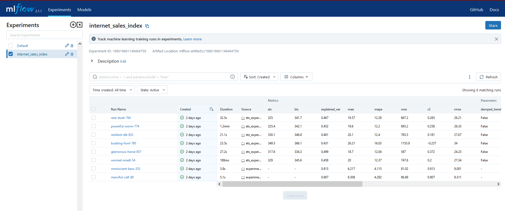
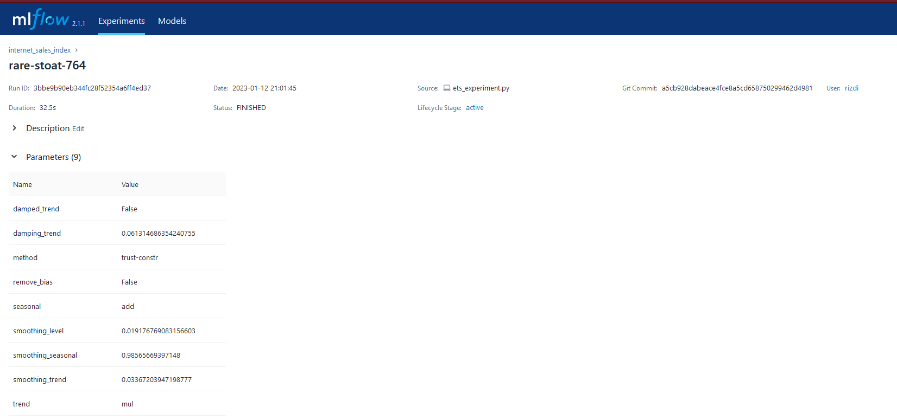
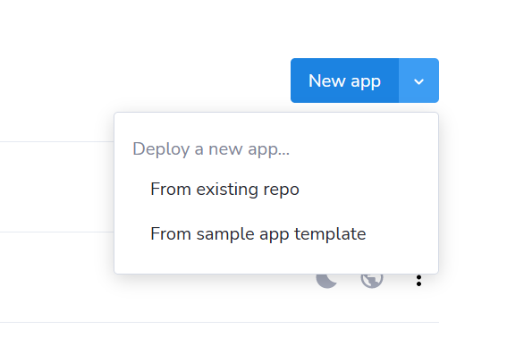
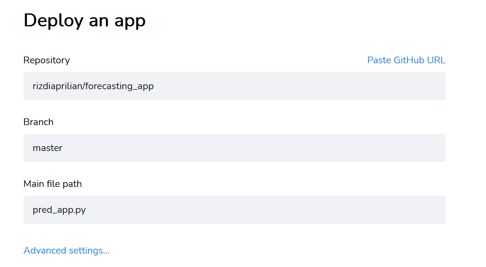

## Project 2: UK Internet Sales Volume

A third project of MLZoomcamp. This repo is served with purpose of presenting what and how transfer learning can understand bird species with machine learning engineering practices.

## 1) Introduction
### Problem Context

This project will see how machine learning can help solve the problem on real case in the UK: internet retail market. 

What would be used here is a dataset consisted of monthly sales and price throughout period 2009-2022. At initial step, we will go through assumption testing whether the time series is stationary or not. Then feature engineering would follow right after getting done with analysis and this step is helpful for machine learning to improve prediction. To obtain objective differentiations when experimenting, both models from library `scikit-learn` and `statsmodels` are called and used here: lasso regression, ridge regression, ARIMA, and Exponential Smoothing Holt-Winters. It is my intention to implement what I have recently been learning on making models with library `statsmodels`. 

If you explore codes, some of codes were adopted from book `Machine Learning Engineering in Action` by Ben Wilson, though that these implementations are in much simpler form to the original ones. Hence, I would like to give credit to him for insightful lessons of building MVP with right approaches and mindsets. 

The hosting of forecast would be arranged and executef in Streamlit cloud. Streamlit is an open-source service that offers wide range of building data app to enhance information transfer by turning python scripts into shareable applications in minutes.  

### Data

Information about internet retail sales are available from portal [Office for National Statistics](https://www.ons.gov.uk/businessindustryandtrade/retailindustry/datasets/retailsalesindexinternetsales), in which its format is presented in Excel. Initially, I planned to automate data extraction to a new csv file (the source has many worksheets) with a python script, however I chose manual approach (copy and paste) data to cut down time required for completing preparation. 

### Files

- `readme.md`: A full description of the project for reader to gain a greater picture of this project.
- `internet_sales.csv`: A csv file that holds information about montly sales of internet retails.
- `internet_sales_UK_preprocessed.csv`: A csv file that holds information about montly sales of internet retails plus newly created extracted features.
- `EDA_and_feature_engineering.ipynb` : A jupyter notebook that covers steps from EDA to feature engineering.
- `Forecasting_internet_sales.ipynb` : A jupyter notebook that covers experiments of various forecasting models.
- `HyperOpt_tuning.ipynb` : A jupyter notebook that covers hyperparameter optimization to find parameters that return a global minima for forecasting models.
- `ets_engine.py`: A python script that contains different functions to support experimentations executable in python.
- `ets_experiment.py`: A python script used for experimenting exponential smoothing together with hyperparameter optimization.
- `experiment_train_forecast.py`: A python script used for experimenting lasso and ridge regression together with hyperparameter optimization.
- `pred_app.py`: A python script used for presenting visual summary of exponential smoothing forecasting with streamlit library.
- `forecast-image.dockerfile`: A dockerfile for building docker image containing functions defined from `lambda_function.py`.

### Important Note about environment

This project used three different environments, and progress of this project were entirely run in Windows local machine: 

- a conda environment using python 3.10.8 for working on `EDA_and_feature_engineering.ipynb` and `Forecasting_internet_sales.ipynb`.
- a conda environment using python 3.9.15 for experimenting image deployment kubernetes in AWS remote.
- a pipenv using python 3.10 for ML experiment management and hyperparameter tuning.  

### Experiment Results

|  Model   | MAE |  MAPE   |  MSE  | RMSE  | R-squared  |  Variance explained |  AIC   |  BIC  |
| ------- | ------ | ------- | ------ | ------- | ------ | ------- | ------ | ------- |
|  Lasso   |  6.144 | 4.071  | 79.63 | 8.924   |  0.915  | 0.915 | N/A | N/A |
|  Ridge     | 12.55 |  8.171 |  242.9   | 15.59  | 0.740   |  0.750  | N/A | N/A |
|  Exponential Smoothing (Holt-Winters)     |  18.64 |  12.44  | 507.2    |  22.52  |   0.457 |  0.47 |  310.8   |  327.4  |
|  ARIMA |  19.86   |  12.31 |  739  |  27.19   |  0.209  |  0.463  | 0.463  |  318.5  | 325.9 |

### HyperParameter Tuning

Finding the possible hyperparameters that return the optimum performace is the task that many engineers or scientists take time and effort on (besides of data wrangling/preprocessing or even feature engineering). Thankfully, MLFlow and HyperOpt are available that bring relevant answers to this issue, allowing them to have take much better accountability and control of managing machine learning lifecycle. API modules of MLFlow provide an API for enabling and configuring logging from various models to MLFlow as well as loading models to be reproduced in different environments.

To run mlflow in the browser:

`mlflow server --backend-store-uri file:///D:/github_repos/mlzoomcamp/MLZoomcamp_2022/Project_2/mlruns --no-serve-artifacts`

Below shown a screening of MLFlow UI which successfully run in the browser: 

#### Streamlit Web App

Steps of deploying `pred_app.py` to streamlit cloud:

1) Login on page https://share.streamlit.io/. 
2) Click "New app" then choose "from existing repo". Note: streamlit can only recognize repos from main branch.

3) Select a repo of yours from github.

4. On advanced setting, just set python version.

You can view the demonstration of forecasting with Streamlit here: https://rizdiaprilian-forecasting-app-pred-app-ueqjjl.streamlit.app/

